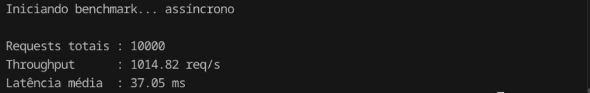

# Async vs Sync Benchmark

This project contains a small FastAPI application backed by a PostgreSQL database and a pair of benchmark clients used to compare synchronous and asynchronous HTTP requests. It can be used to observe latency and throughput differences when making many concurrent requests.

## Results

### Sync


### Async


## Requirements

- Python 3.13+
- PostgreSQL database

The project dependencies are declared in `pyproject.toml`. Install them with `pip`:

```bash
pip install -r uv.lock
```

## Environment Variables

The database connection details are provided through environment variables:

- `DATABASE_URL` – connection string used by the application
- `DB_NAME`, `DB_USER`, `DB_PASSWORD`, `DB_HOST`, `DB_PORT` – used by the data population script

Create a `.env` file or export the variables in your shell before running the code.

## Running the Application

Start the FastAPI server with `uvicorn`:

```bash
uvicorn main:app --reload
```

The service exposes a single endpoint:

- `GET /clientes/{id}` – returns a client record from the database

## Populating Sample Data

Use the `generator_fake_clients.py` script to seed the database with sample clients:

```bash
python generator_fake_clients.py
```

## Benchmark Clients

Two benchmark scripts are provided:

- `benchmark_client_async.py` – performs requests using `httpx.AsyncClient`
- `benchmark_client_sync.py` – performs requests using `requests`

Each script will issue 10,000 requests against the running API and print throughput and latency metrics.

Run them with:

```bash
python benchmark_client_async.py
```

```bash
python benchmark_client_sync.py
```

Compare the output numbers to evaluate the performance differences between asynchronous and synchronous requests.
